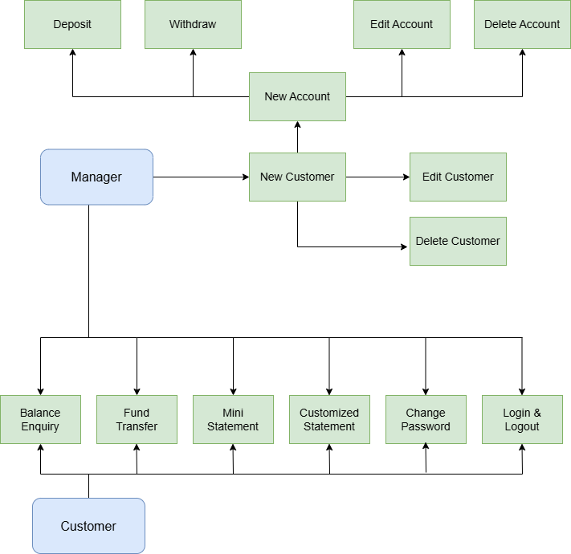

# Guru99 Banking Application – Manual Testing Project

## Project Overview

This repository contains a complete **end-to-end manual testing project** performed on the Guru99 Banking web application across multiple versions (V1 – V4).

The objective of this project was to simulate real-world QA activities following the **Software Testing Life Cycle (STLC)** including:

- Requirement Analysis
- Test Planning
- Test Case Design
- Test Execution
- Regression Testing
- Defect Tracking
- Change Request Handling
- Test Closure Activities

---

## Application Under Test

The Guru99 Banking Demo Application simulates a banking system with features such as:

- Customer registration
- Login system
- Account management
- Deposit & withdrawal
- Fund transfer
- Balance checking
 
 There are two main roles in the system:

- **Manager role**: Has access to all the modules.
- **Customer role**: Accesses only some features of the system.

This is the overall system chart:




---
## Application release versions
### Version 1 – Requirement Analysis & Test Case Design

The first version of the Banking Site can be accessed via the following link:
```
http://demo.guru99.com/V1/
```

Activities performed:
- [SRS_v1](https://github.com/medrarem2704/Guru99-manual-testing-project/blob/main/v1/SRS_v1.docx) review
- Functional requirement analysis
- Test case design based on specifications: [TestCaseSuite_v1](https://github.com/medrarem2704/Guru99-manual-testing-project/blob/main/v1/TestCaseSuite_v1.xlsx)
- Positive and negative scenario identification
- Integration scenario planning: [IntegrationPlanning_v1](https://github.com/medrarem2704/Guru99-manual-testing-project/blob/main/v1/IntegrationPlanning_v1.xlsx)
- Test case execution
- Defects identification
- Documentation of bugs in the [BugTracker_v1](https://github.com/medrarem2704/Guru99-manual-testing-project/blob/main/v1/BugTracker_v1.xlsx)

### Version 2 – Integration Testing Preparation

The second version of the Banking Site can be accessed via the following link:

(Please use the login credentials generated for version 1 to access the site.
)

```
http://demo.guru99.com/V2/
```

Activities performed:
- Analysis of the updated requirements document [SRS_v2](https://github.com/medrarem2704/Guru99-manual-testing-project/blob/main/v2/SRS_v2.docx)
- Update and maintenance of existing test cases to align with new requirements: [TestCaseSuite_v2](https://github.com/medrarem2704/Guru99-manual-testing-project/blob/main/v2/TestCaseSuite_v2.xlsx)
- Creation of a Unit Test Plan for the **Balance Enquiry** module
- Re‑execution of failed test cases from Version 1
- Execution of regression test cases to ensure that existing functionalities remain unaffected
- Verification that reported defects have been correctly fixed: [BugTracker_v2](https://github.com/medrarem2704/Guru99-manual-testing-project/blob/main/v2/BugTracker_v2.xlsx)
- Update of the integration planning: [IntegrationPlanning_v2](https://github.com/medrarem2704/Guru99-manual-testing-project/blob/main/v2/IntegrationPlanning_v2.xlsx)


### Version 3 – System Testing Planning & Execution
The third version of the Banking Site can be accessed via the following link:

```
http://demo.guru99.com/V3/
```

Activities performed:
- Analysis of the updated requirements document [SRS_v3](https://github.com/medrarem2704/Guru99-manual-testing-project/blob/main/v3/SRS_v3.docx)

## Testing Types Performed

Functional Testing

System Testing

Integration Testing Preparation

Regression Testing

Smoke Testing

Requirement Change Impact Analysis

Defect Verification Testing

Test Closure Activities

---

## Documents Included

### SRS Documents

Multiple versions analyzed:

SRS v1  
SRS v3  
SRS v4  

Used to identify requirement changes and update test coverage.

---

### Test Cases

Functional test cases created based on:

SRS requirements  
UI mockups  
Workflow analysis  

Includes positive and negative scenarios.

---

### Integration Planning

Integration scenarios designed between:

Manager Module

Customer Module

Transaction Workflows

---

### System Test Plan

Prepared and updated after requirement changes:

Scope definition

Entry / Exit criteria

Risk analysis

Regression scope updates

Test environment details

---

### Bug Tracking

Defects logged using structured tracking sheets including:

Steps to reproduce

Expected vs actual result

Severity level

Environment reference (V4)

Regression status

---

### Regression Testing (Version 4)

Previously failed scenarios re-tested

Critical workflows validated:

Customer creation

Deposit / Withdrawal

Mini statement

Authentication flows

Smoke testing performed for release stability validation

---

### Test Closure Activities

Final validation included:

Defect rejection ratio calculation

Top defect themes identification

Test case effectiveness measurement

Residual risk documentation

Release readiness confirmation

Lessons learned summary

---

## Tools Used

Excel – Test case management

Word – Test plan documentation

Browser Developer Tools

Manual exploratory testing techniques

GitHub – Documentation hosting

---

## Skills Demonstrated

Requirement Analysis

Test Case Design

Regression Testing

System Testing

Integration Testing Preparation

Defect Tracking

Traceability Maintenance

Change Request Analysis

Release Validation

Test Closure Reporting

STLC Execution

---

## Project Outcome

Successfully executed full-cycle manual testing across multiple releases of the Guru99 Banking application.

Validated functional workflows

Verified defect fixes in Version 4

Updated test plan after requirement changes

Performed regression testing

Completed test closure documentation

Simulated real-world QA workflow in a banking domain environment

---

## 📚 Reference

Project source:

https://www.guru99.com/live-testing-project.html

---